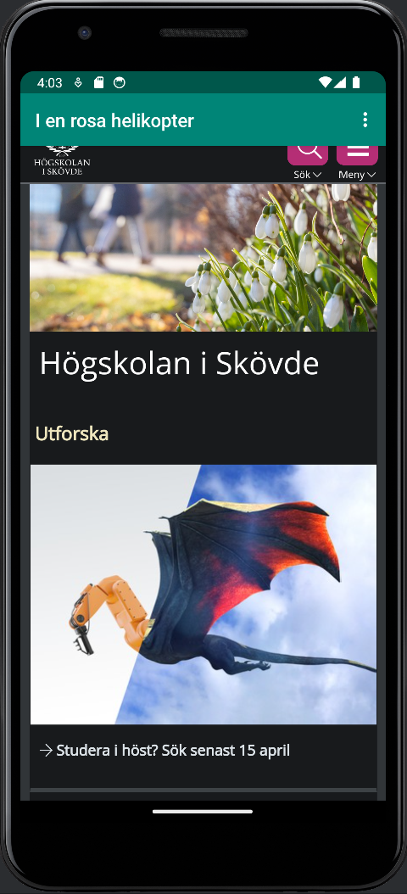
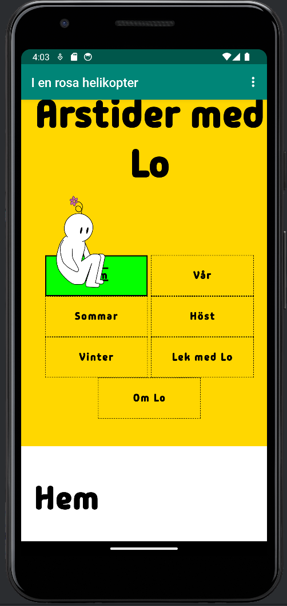

# Rapport

Koden under visar hur den externa och den interna sidan visas. Funktionen som de ligger i är en variabel som med hjälp av if vet vilken sida som den ska visa.
Om användaren trycker på "external" kommer koden att söka upp och kunna visa den i WebView som lades till.
Vid tryck av "internal" kommer koden att söka rätt på url skriven inom parentserna och visa den. 
```
 @Override
    public boolean onOptionsItemSelected(MenuItem item) {
        // Handle action bar item clicks here. The action bar will
        // automatically handle clicks on the Home/Up button, so long
        // as you specify a parent activity in AndroidManifest.xml.
        int id = item.getItemId();

        //noinspection SimplifiableIfStatement
        if (id == R.id.action_external_web) {
            myWebView.setWebViewClient(new WebViewClient());
            myWebView.loadUrl("https://his.se");
            return true;
        }

        if (id == R.id.action_internal_web) {
            myWebView.loadUrl("file:///android_asset/index.html");
            return true;
        }

        return super.onOptionsItemSelected(item);
    }
    
```
För denna uppgift skulle extern och intern web sida kunna visas innuti applikationen. För att göra detta lades kod in som gör så att appen kan nå internet. 
Efter detta lades en view - WebView in på skärmen i design som sedan fick ett id. Id:t för view användes för att efter att skapa variabler, säka rätt på den
view som ska visas, alltså WebView. 
Steget efter var att lägga till en extern websida i koden där länken till sidan använde loadUrl().
För att få tillgång till en intern sida lades all data om den sidan in i mappen "assets" och efter det länkades denna under "if (id == R.id.action_internal_web) ". 
Vid tryck på de tre punkterna uppe på höger sida finns det val om den externa eller den interna sidan ska visas.




